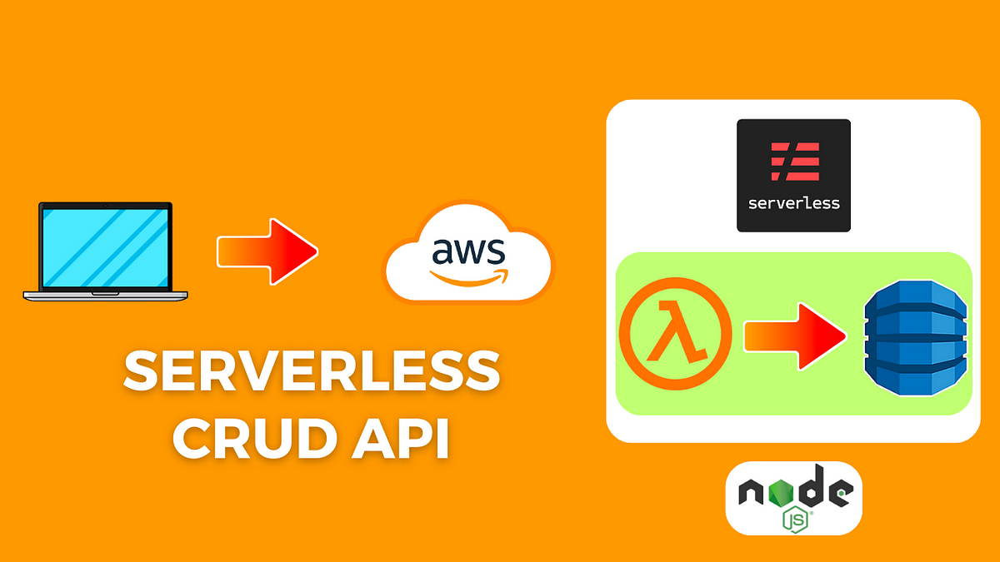

# Servicio CRUD de AWS Lambda con Node.js

Este proyecto implementa un servicio usando Serverless Framework en AWS Lambda para operaciones CRUD utilizando Node.js. A continuación, se presenta una visión general de su estructura y configuración:

## Detalles del Servicio

- **org**: apc91 *(Asegura el uso correcto de la clave de acceso de Serverless Framework)*
- **app**: aws-lambda-crud-node *(Habilita las funciones del Dashboard de Serverless Framework)*
- **service**: aws-lambda-crud-node *(Nombre del proyecto y se añade a los nombres de los recursos de AWS)*

## Configuración del Proveedor

- **name**: aws
- **region**: us-east-1
- **runtime**: nodejs20.x
- **iamRoleStatements**: Define los permisos del rol IAM para el acceso a DynamoDB.

## Funciones

1. **createTask**
   - **Handler**: src/task.addTask
   - **Descripción**: Crea tareas
   - **Evento**: HTTP API, POST /task

2. **getTasks**
   - **Handler**: src/task.getTasks
   - **Descripción**: Obtiene todas las tareas
   - **Evento**: HTTP API, GET /tasks

3. **getTask**
   - **Handler**: src/task.getTask
   - **Descripción**: Obtiene una tarea específica
   - **Evento**: HTTP API, GET /task/{id}

4. **updateTask**
   - **Handler**: src/task.updateTask
   - **Descripción**: Actualiza una tarea
   - **Evento**: HTTP API, PUT /task/{id}

5. **deleteTask**
   - **Handler**: src/task.deleteTask
   - **Descripción**: Elimina una tarea
   - **Evento**: HTTP API, DELETE /task/{id}

## Recursos

- **usersTable**: Configuración de la tabla DynamoDB
  - **TableName**: APC-taskTable
  - **BillingMode**: PAY_PER_REQUEST
  - **AttributeDefinitions**: Define los atributos, por ejemplo, id como tipo string.
  - **KeySchema**: Define la clave primaria utilizando id como HASH.

## Instrucciones de Despliegue

1. **Instalar Serverless Framework**: Asegúrate de tener instalado Serverless Framework globalmente.
   ```bash
   npm install -g serverless


## Deployment


```
serverless deploy
```

## Eliminar 


```
serverless remove
```
